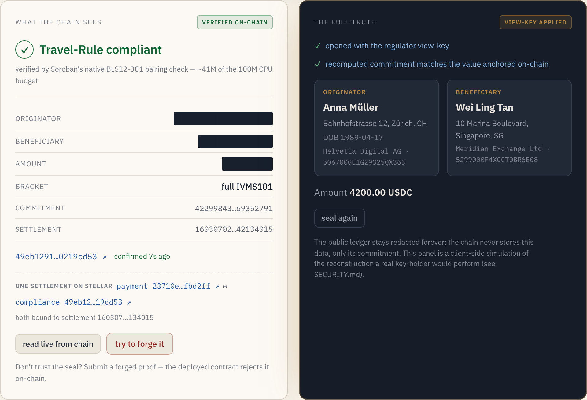

# Veritas

**A privacy-preserving Travel Rule compliance layer for Stellar — proven on-chain.**

**Live demo:** _deployment URL to be added on release_ — generate the proof in your own browser.

> **$4.3B.** What Binance paid the U.S. DOJ, FinCEN, CFTC, and OFAC in November 2023 — FinCEN's $3.4B
> share alone the largest Bank Secrecy Act enforcement action in history — with AML-program,
> registration, and SAR-filing failures at the core. It's exactly the cross-border customer-data
> breakdown FATF's Travel Rule exists to prevent, and today there is still **no shared, verifiable proof
> that a Travel Rule check ever happened** — every VASP just trusts its own private database, which a
> regulator must take on faith and which can be quietly edited or "lost."

When a licensed exchange (a VASP) sends a stablecoin transfer for a customer to another exchange, FATF
Recommendation 16 (the "Travel Rule") forces the sender to hand over the customer's identifying details.
Today that data moves through off-chain networks in the [IVMS101](https://www.intervasp.org/) format —
and every Travel Rule rail carrying it (Notabene, Sygna, TRISA, TRP) is an encrypted inbox that leaves
no shared evidence the exchange actually happened. Veritas makes the check itself a public,
forgery-proof fact: a Groth16 proof verified inside a Soroban contract, anchored to the very settlement
it governs.

Veritas adds the missing piece: a **single zero-knowledge proof, verified inside a Soroban smart
contract and anchored to a settlement**. One proof attests four things at once, *without revealing any
personal data*:

- both counterparties are **licensed VASPs in the same registry**;
- the transfer's **value bracket was correctly computed over a hidden amount** — full IVMS101 required
  at or above the ~$1,000 FATF threshold, reduced below;
- the **receiving VASP's acknowledgement** is bound into the proof;
- a **regulator-openable commitment** binds the full attestation.

The result is a tamper-evident, non-repudiable, settlement-anchored **compliance receipt** that no
single party owns: the public sees only a verified ✓, while a regulator holding the view key can open
the full record.



*A live run: the chain sees a verified compliance receipt with every identity and the amount redacted;
the regulator's view key opens the full IVMS101 record. Both panels reflect a real transaction — the
payment and its compliance receipt share one settlement id on testnet.*

## ✅ Verify it yourself on Stellar testnet

This isn't a slide — a real Groth16/BLS12-381 proof from the Veritas circuit is verified inside a
Soroban contract on testnet. Click and confirm:

| What | Link |
|---|---|
| **Veritas contract** (verifies + anchors compliance) | [`CB6DCNEG…OFWV`](https://stellar.expert/explorer/testnet/contract/CB6DCNEGNXP7WQB3XVDABZ2TUNM5DSK4VYXLCE4OZWGXMGSZRGYBOFWV) |
| **`submit_compliance`** — real proof verified, attestation anchored, `verified` event | [tx `20c48e42…`](https://stellar.expert/explorer/testnet/tx/20c48e426a3bf44b7a719226f06db8f919da9b3028fc2f6ce20355554ddedc28) |
| Veritas circuit proof verified standalone (`verify_proof → true`) | [tx `11f2f89b…`](https://stellar.expert/explorer/testnet/tx/11f2f89b8ff38a01b538b7a24d66cc691fe846038fd3db34612de232b657ef5b) |
| Pipeline proof-of-life — first trivial proof verified on-chain | [tx `51c26280…`](https://stellar.expert/explorer/testnet/tx/51c26280818a3eca81293c4c281d85740d363aafb0cb183c1d2a6647c21eb8da) |

The on-chain pairing check costs ~41M of the 100M CPU budget. The attestation read back from chain
(`get_attestation`) contains **no personal data** — only `{bracket, att_commitment, settlement_ref,
submitter}`.

## Why ZK, why on-chain, and why Stellar

The PII already moves fine off-chain — what's missing is a **shared, forgery-proof compliance fact**
bound to settlement that no party owns. That's the one thing a smart contract gives you that an
encrypted inbox can't. The ZK here is **load-bearing**, not decorative: the compliance attestation
cannot exist without the proof, which shows the *correct compliance computation ran over private
inputs* (the hidden amount, the registry membership, the IVMS commitment) and emits a public ✓ that a
signature alone could only produce by **revealing** the very data the Travel Rule is trying to move
privately.

**Why Stellar specifically:** Soroban ships **native BLS12-381 host functions**
([CAP-0059](https://github.com/stellar/stellar-protocol/blob/master/core/cap-0059.md), shipped in
Protocol 22) — on-chain ZK verification is the use case they were introduced for — so the Groth16
pairing check runs *inside* the contract for ~41M of the 100M CPU budget. Even
[TRISA](https://trisa.dev)'s own *Privacy-Preserving Travel Rule Compliance* whitepaper proposed
zero-knowledge proofs for exactly this while flagging their cost; on Soroban the
check is not just affordable but negligible — the linked `submit_compliance` transaction's
`fee_charged` was **0.1027779 XLM**, a few cents, so every compliance proof can be verified on-chain.
The verifier follows the official
[stellar/soroban-examples `groth16_verifier`](https://github.com/stellar/soroban-examples/tree/main/groth16_verifier)
pattern, on the Circom → Groth16 → BLS12-381 path — the cheapest curve to verify on-chain today (newer
protocol upgrades add BN254/Poseidon primitives targeting other proving stacks).

Other chains have pairing precompiles; the conjunction is what matters. Native curve ops inside the
contract VM, cents-level metered fees, ~5-second finality, and the same ledger serving as a
regulated-stablecoin settlement rail: the proof verifier *is* the payment rail. That is what makes
Veritas a Stellar project rather than a generic ZK demo — each demo run sends a **real testnet
settlement payment** and derives the proof's `settlementRef` from it, so the value movement and its
compliance receipt share one settlement id on Stellar, verifiable on stellar.expert as two linked txs.

Stellar also already standardizes the regulated flow itself —
[SEP-12](https://github.com/stellar/stellar-protocol/blob/master/ecosystem/sep-0012.md) KYC,
[SEP-31](https://github.com/stellar/stellar-protocol/blob/master/ecosystem/sep-0031.md) cross-border
payments, [SEP-8](https://github.com/stellar/stellar-protocol/blob/master/ecosystem/sep-0008.md)
regulated assets — but none of it produces a shared on-chain fact that the Travel-Rule check happened;
Veritas is that receipt layer (see [docs/architecture.md](./docs/architecture.md)).

## What's real vs. simulated (honest disclosure)

Real: the circuit, the proof, its on-chain verification, and every artifact linked above. Simulated: the
participating VASPs and the customer PII (synthetic) — you can't onboard a real licensed exchange for a
hackathon. Full breakdown, including what's deferred to a production build, in **[SECURITY.md](./SECURITY.md)**.

## Architecture

```
┌─────────────┐   IVMS101 (encrypted, off-chain)   ┌─────────────┐
│   VASP A    │ ─────────────────────────────────► │   VASP B    │
│ (originator)│ ◄───────── acknowledgement ──────── │(beneficiary)│
└──────┬──────┘                                     └─────────────┘
       │ Groth16 proof (Circom / BLS12-381), generated off-chain
       ▼
┌──────────────────────────────────────────────────────────────┐
│  Veritas Soroban contract (Stellar testnet)                  │
│   • verify_groth16 — real BLS12-381 pairing check            │
│   • pin registry root + FATF threshold; bind settlementRef   │
│   • store the regulator-openable commitment                  │
│   • emit "verified ✓" (no personal data)                     │
└──────────────────────────────────────────────────────────────┘
       │ public sees only ✓        │ regulator opens with view key
       ▼                           ▼
   stellar.expert              full IVMS101 attestation
```

The circuit (`circuits/veritas.circom`) proves: Merkle membership of both VASP leaves in the same
registry (root exposed as a public output the contract pins), `leafA ≠ leafB`, a **range-checked**
bracket over the hidden `amount`, and a Poseidon commitment binding the whole attestation (payload,
acknowledgement, settlement, regulator key, amount, bracket, both leaves).

## Repository layout

| Path | What it is |
|---|---|
| `circuits/` | Circom circuit + Poseidon-free fixture generator |
| `contracts/veritas/` | Rust Soroban contract — the on-chain compliance anchor (11 unit tests) |
| `tools/encode/` | snarkjs-JSON → Soroban-bytes encoder (arkworks serialization) |
| `web/` | SvelteKit frontend — the public-✓ → regulator-reveal demo |
| `docs/`, `SECURITY.md` | architecture + threat model |

## Run it yourself

```bash
# 1. toolchain (circom, snarkjs, stellar-cli, rust wasm target)
./scripts/setup.sh

# 2. circuit -> proof (BLS12-381 Groth16)
cd circuits && npm install && node gen-veritas-input.mjs
../scripts/build-circuit.sh veritas      # compile + trusted setup + vkey
# (generate witness + proof with snarkjs; see scripts/)

# 3. contract: test + deploy + verify on testnet
cargo test --manifest-path contracts/veritas/Cargo.toml
# deploy with the __constructor (admin, registry_root, vk), then submit_compliance — see scripts/deploy.sh

# 4. the demo
cd web && npm install && npm run dev
```

## Engineering & review

Built in verified phases, each hardened by independent code-review and
security audit passes. Those audits caught and fixed real issues — an unconstrained `amount`
(ZK under-constraint), a public-signal ordering bug, and a front-runnable initializer — before this
README was written. Honest work-in-progress over a polished mystery.

## License

MIT — see [LICENSE](./LICENSE).
